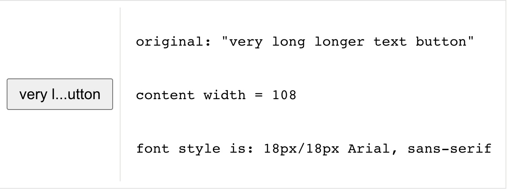

# Truncate From Middle Hook

This react hook dynamically truncates text from the middle

## Demo

🚀 See [Demo:](https://6271164ce9065200596d00f0--phenomenal-brigadeiros-2b0d14.netlify.app/)

## Installation

```bash
yarn add use-truncate-from-middle
```

or

```bash
npm install use-truncate-from-middle
```

## Usage

```javascript
import { useTruncateFromMiddle } from 'use-truncate-from-middle';
```

```javascript
const Textarea = ({
  originalLongText = 'very long longer text button',
  width = '128px', // width (total)= content width + border width + padding
  font = '18px/18px Arial, sans-serif',
}) => {
  const btnRef = React.useRef(null);

  const { truncatedText, contentWidth } = useTruncateFromMiddle({
    ref: btnRef,
    originalText: originalLongText || '',
    middleChars: '...',
  });

  return (
    <>
      <textarea
        ref={btnRef}
        rows={1}
        style={{ width: width, font: font }}
        value={truncatedText}
        readOnly
      />
    </>
  );
};
```

<figure>
<figcaption>Truncated  from middle with given parameters</figcaption>

</figure>

### Props

| Prop           | Type     | Description                                                                                                       | Default |
| -------------- | -------- | ----------------------------------------------------------------------------------------------------------------- | ------- |
| `originalText` | `String` | Initial text value of the component. It is going to be truncated from middle if necessary.                        | `''`    |
| `middleChars`  | `String` | The ellipsis to use when the text is truncated from middle.                                                       | `'...'` |
| `ref`          | `Object` | The `ref` of the text container component.It is required to calculate component's width and to get its font style | `null`  |
